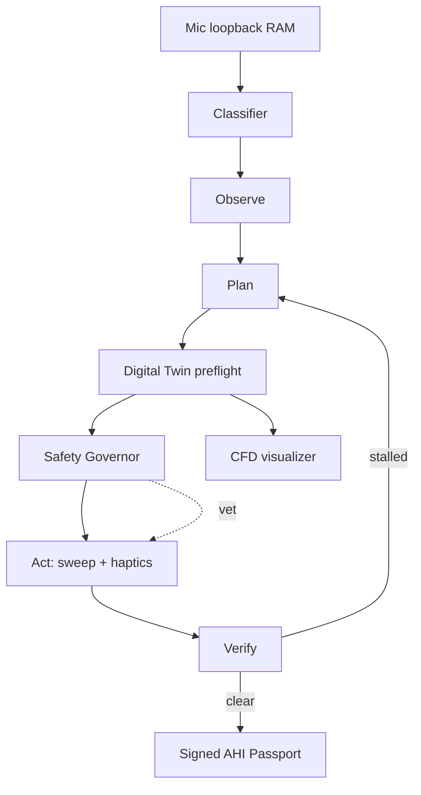

# Architecture (AeroAcoustic AI · by NIKHIL CHARY SRIRAMOJU)

Web build maps to: `js/opav.js` (agent), `js/twin.js` (Twin), `js/safety.js` (governor), `js/audio.js` (sweep, haptics, mic), `js/ai.js` (classifier), `js/cfd.js` (visualizer), `js/passport.js` (AHI + ECDSA signing).

## Native roadmap (Swift/Kotlin)
Port the same modules to AVAudioEngine + CoreHaptics (iOS) or Oboe + VibrationEffect (Android) for sample-accurate haptic phase lock and barometer seal checks. Web limits: coarse Vibration API (Android only), no barometer, no speaker electrical data.
